# Nagardoot Video — Code Flow & Architecture

This document describes how the **Expo mobile app**, **Flask upload server**, and **pothole inference** fit together. Diagrams use [Mermaid](https://mermaid.js.org/) (renders on GitHub, GitLab, many Markdown viewers, and VS Code/Cursor with a Mermaid extension).

---

## 1. End-to-end system context

High-level view: phone captures video + GPS, zips, uploads to laptop; laptop stores zip and can run YOLO inference.

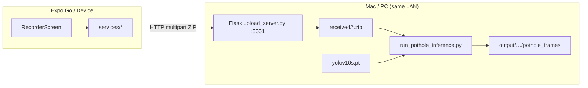

---

## 2. Repository layout (logical blocks)

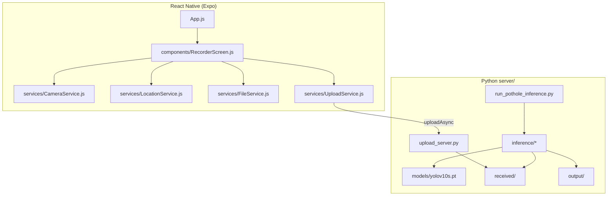

---

## 3. UI state machine (`RecorderScreen`)

Phases control which buttons are enabled.

```mermaid
stateDiagram-v2
  [*] --> idle : app load

  idle --> recording : Start Recording\n(camera+GPS ready)
  recording --> processing : Stop Recording
  processing --> stopped : zip saved OK
  processing --> idle : save failed

  stopped --> uploading : Upload Session\n(IP set)
  stopped --> idle : (no direct edge;\nmust upload to clear)

  uploading --> idle : upload OK
  uploading --> stopped : upload failed

  idle --> idle : permissions refresh
  note right of stopped
    Status text: "Session ready"
    Start disabled until back to idle
  end note
```

---

## 4. Permission & startup flow

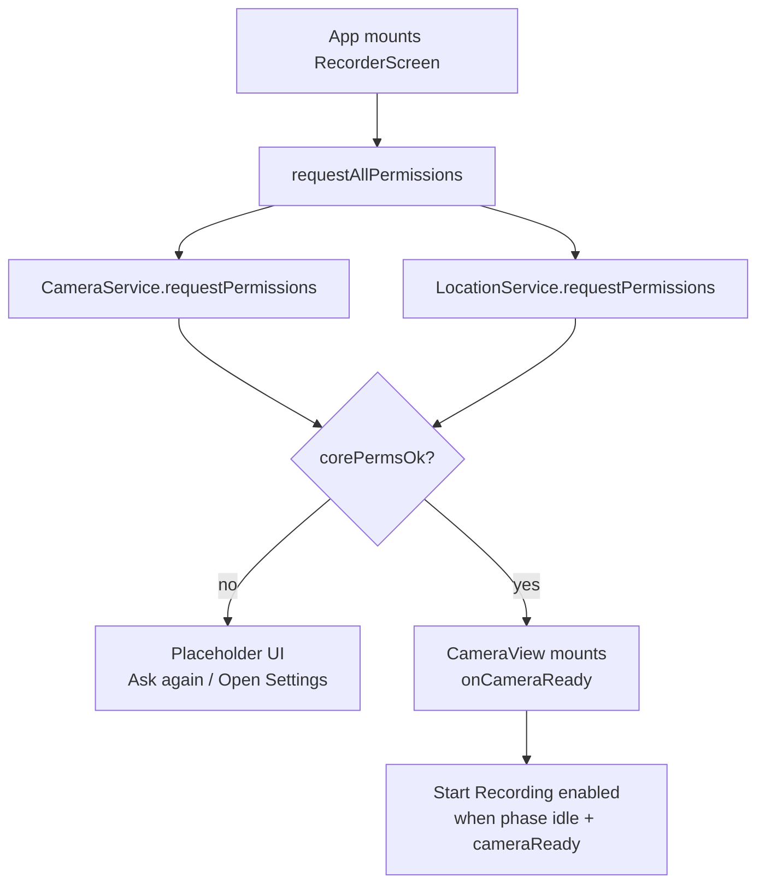

---

## 5. Start Recording — sequence

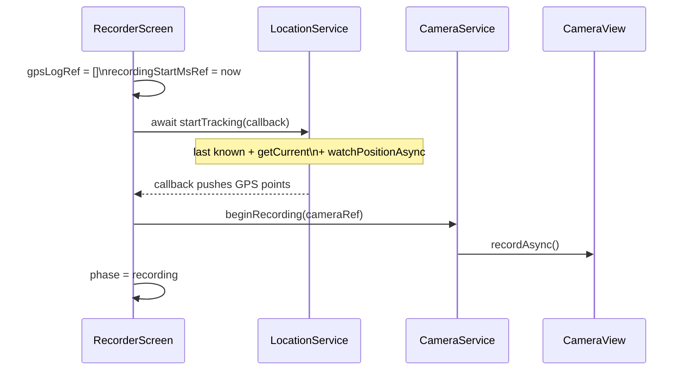

---

## 6. Stop Recording — sequence

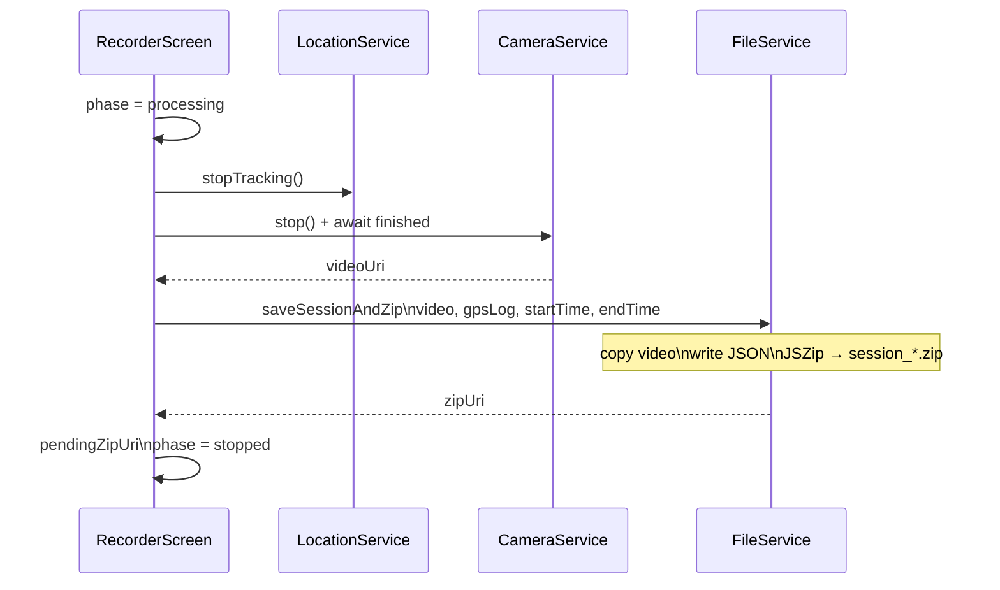

---

## 7. Session packaging (`FileService`)

Block diagram of what gets written before upload.

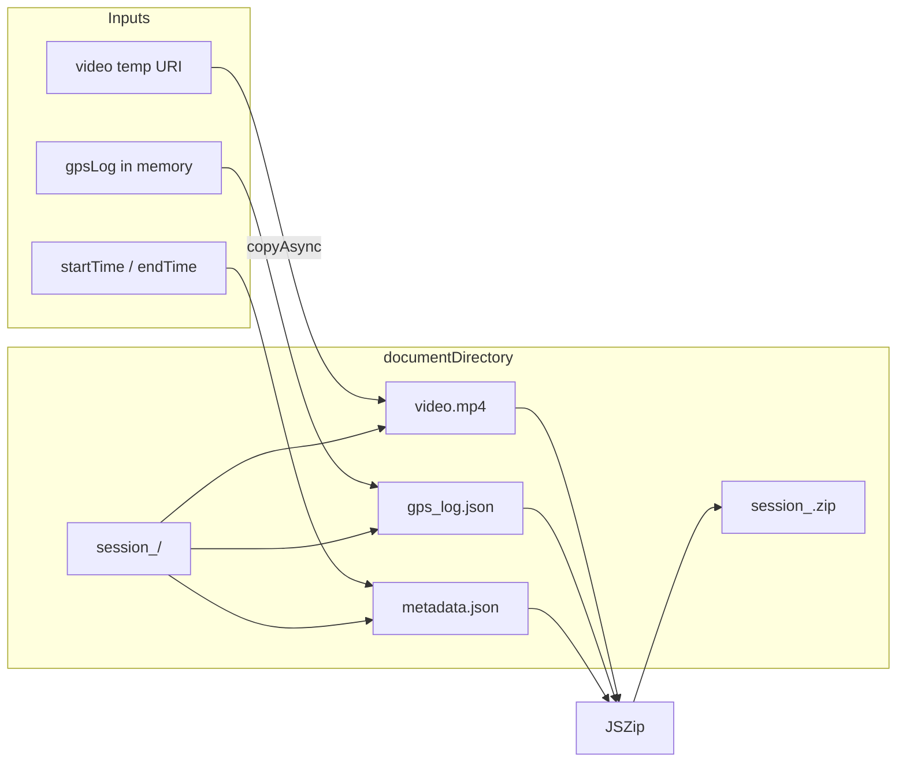

---

## 8. Upload flow (`UploadService` → Flask)

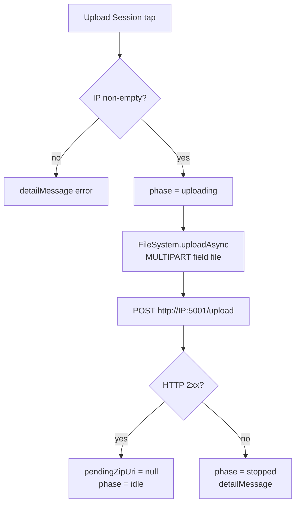

---

## 9. Flask upload server

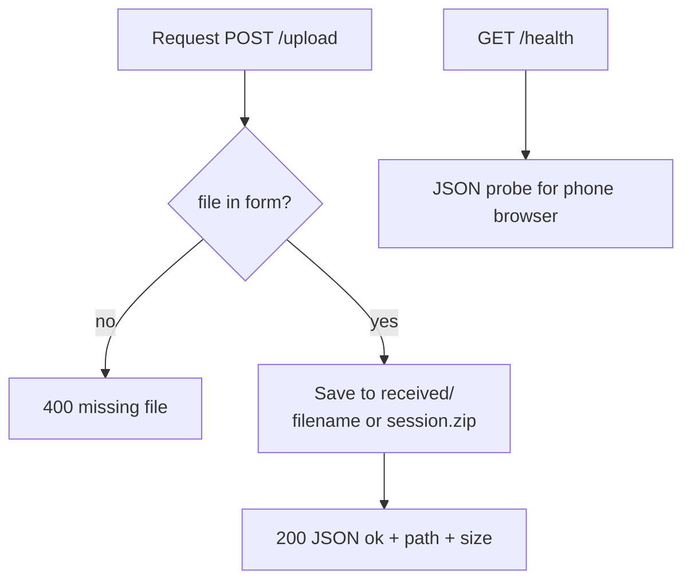

---

## 10. Pothole inference pipeline

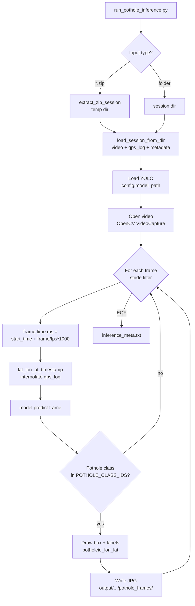

---

## 11. GPS ↔ frame time alignment

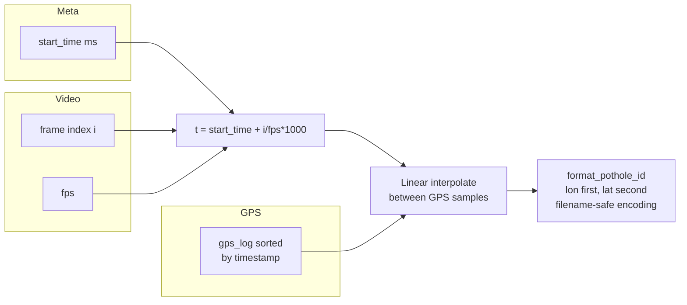

---

## 12. Configuration touchpoints

| Area | Where | Purpose |
|------|--------|--------|
| Upload URL | `UploadService.js` — `DEFAULT_UPLOAD_PORT`, IP in UI | Laptop receives ZIP |
| Cleartext / local network | `app.json` iOS/Android | HTTP to LAN |
| Model path | `server/inference/config.py` or `POTHOLE_MODEL` | YOLO weights |
| Detection | `POTHOLE_CONF`, `POTHOLE_CLASS_IDS`, `POTHOLE_FRAME_STRIDE` env | Tuning inference |
| Flask port | `upload_server.py` / `PORT` env | Default 5001 (avoid macOS 5000) |

---

## 13. Quick command reference

| Step | Command / action |
|------|------------------|
| Run app | `npx expo start` → Expo Go |
| Run upload API | `cd server && python upload_server.py` |
| Run inference | `cd server && python run_pothole_inference.py received/<session>.zip` |
| All zips | `python run_pothole_inference.py --all-received` |

---

## Viewing these diagrams

- **GitHub / GitLab**: Open this file; Mermaid renders automatically in many repos.
- **VS Code / Cursor**: Install a “Mermaid” preview extension, or paste diagrams into [mermaid.live](https://mermaid.live).
- **Export**: From mermaid.live you can export PNG/SVG for slides or PDFs.

If you add new flows (e.g. background upload, cloud storage), extend the matching section above so this file stays the single architecture reference.
